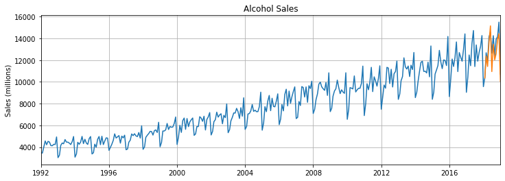

# RNN-pytorch
 Collection of RNN models and implementations

### Time Series
Time series prediction with recurrent neural networks
#### Summary
 Using a _LSTM_ model for time series prediction. </br>
 
 Using Alcohol sales from the [Federal Reserve Economic Database (FRED)](https://fred.stlouisfed.org/)
 #### Findings
 **Alcohol Sales** results of LSTM model trained on 100 epochs, final loss of ~0.00007281<br>


</br>

### NLP
Generate text with recurrent neural networks
#### Summary
Using a _LSTM_ model for generating text.

Using Shakespeare as an example
#### Findings
Trained on 20 epochs, with ~10000 steps, final loss of ~1.3138666152

**Example Input**
```
                     1
  From fairest creatures we desire increase,
  That thereby beauty's rose might never die,
  But as the riper should by time decease,
  His tender heir might bear his memory:
  But thou contracted to thine own bright eyes,
  Feed'st thy light's flame with self-substantial fuel,
  Making a famine where abundance lies,
  Thy self thy foe, to thy sweet self too cruel:
  Thou that art now the world's fresh ornament,
  And only herald to the gaudy spring,
  Within thine own bu

```

**Example output**

```
The PRINCE HERRY and MARCIUS and SOMERSET
  SHYLOCK. It is no more to strike me, and the warding
    To this, I shall see, that I have set him,
    And to the world was stay with him on this,
    With sorrow that I would have seen thy state,
    With the service of merry trial and
    That the subject of this body were
    When the securest thing of his tongue does.
    The sun are strange and too and this doth shake
    The way and blessed with a field of heaven
    As that the world will stay again.
                                             Exit, worse than her horse.  
  CORIOLANUS. The way, a service, thanks, and see how she hath.
    I have sent to me.
  CLEOPATRA. Welcome, my lady,
    And that thou wast not so made and set thee.  
    I am an enemy, and we say, they say,
    That whom thy sons, while he shall strong and strange
    To stand to seek the company and strong,
    The market or a false of the conscience,
    Whose truth and hand of mine are striking thine.
    Though I
```
